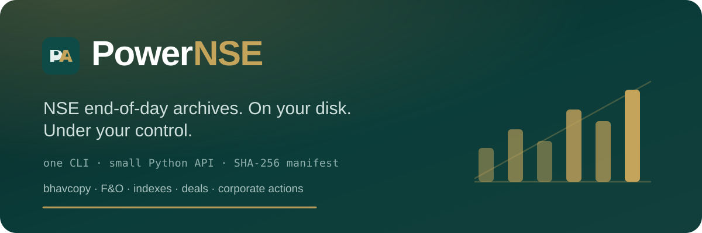

<p align="center">
  
</p>

<h1 align="center">PowerNSE</h1>

<p align="center">
  <a href="https://pypi.org/project/powernse/"></a>
  <a href="https://pypi.org/project/powernse/"></a>
  <a href="https://github.com/inquilabee/powernse/actions/workflows/ci.yml"></a>
  <a href="LICENSE"></a>
  <a href="https://inquilabee.github.io/powernse/"></a>
  <a href="DISCLAIMER.md"></a>
</p>

<p align="center">
  
</p>

<p align="center">
  <strong>NSE end-of-day archives. On your disk. Under your control.</strong><br/>
  One CLI · a small Python API · no third-party dump path
</p>

<p align="center">
  <a href="https://inquilabee.github.io/powernse/">Docs</a> ·
  <a href="https://inquilabee.github.io/powernse/user/quickstart/">Quick start</a> ·
  <a href="https://pypi.org/project/powernse/">PyPI</a> ·
  <a href="CHANGELOG.md">Changelog</a> ·
  <a href="DISCLAIMER.md">Disclaimer</a>
</p>

<table>
  <tr>
    <td>

**Disclaimer** — PowerNSE is **not affiliated with, endorsed by, or connected to**
the National Stock Exchange of India (NSE) or any related entity. It is an
unofficial tool for **educational and research** use only — not financial advice,
and not an NSE product or data feed.

You are responsible for how you use the software and any data it retrieves,
including compliance with NSE terms of use. The author accepts **no liability**
for losses, damages, or other consequences arising from use of this package.
Use at your own risk.

Full text: [DISCLAIMER.md](DISCLAIMER.md) ·
[docs](https://inquilabee.github.io/powernse/user/disclaimer/).

</td>
  </tr>
</table>

______________________________________________________________________

NSE publishes end-of-day files. The URLs drift, the session cookie is fussy, and
relearning the layout every quarter is a tax. **PowerNSE** downloads those
archives into a local `nse-data/` tree, records a SHA-256 manifest, and gives you
OHLC from the CLI or from Python — from the exchange, not from a scraped dump.

Two ways in:

1. **Build it** — point the downloaders at NSE (`bhavcopy`, F&amp;O, indexes, deals, …).
2. **Fetch it** — `powernse fetch-bundle` extracts the tracked `nse-data/` from this repo.

Requires Python **3.13+**.

## Install

```bash
pip install powernse
```

## Quick start

```bash
powernse bhavcopy --resume
powernse fo-bhavcopy --resume --days 30
powernse index-closes --from 2024-08-01 --to 2024-08-05
powernse index-closes --backfill         # one-time: history before your earliest staged file
powernse index-history                   # one-time: per-index EOD levels back to ~1995
powernse equity-list --date 2024-08-09   # EQUITY_L security master
powernse fetch-bundle --force            # optional: GitHub-hosted archive
powernse status
powernse verify                          # session gaps in the core dated archives
powernse ohlc RELIANCE --from 2024-08-01 --to 2024-08-05
powernse doctor
```

```python
from datetime import date
from powernse import BhavcopyDownloader, NSEData

BhavcopyDownloader("./nse-data").download_range(date(2024, 8, 1), date(2024, 8, 5))
data = NSEData("./nse-data")
bars = data.ohlc("RELIANCE", from_date=date(2024, 8, 1), to_date=date(2024, 8, 5))
adj = data.ohlc_adjusted("RELIANCE", from_date=date(2024, 8, 1), to_date=date(2024, 8, 5))
```

Walkthrough: [quickstart](https://inquilabee.github.io/powernse/user/quickstart/).

## What you get

| Surface | Covers |
| --- | --- |
| Cash / F&O / full bhavcopy | Daily equity & derivatives archives; delivery / traded-value reads |
| Index closes & constituents | Levels, membership snapshots, a bundled index catalog + `Index` handle |
| Bulk / block deals, F&O ban | Typed DataFrames; `secban()` / `is_banned()` |
| Security master (`EQUITY_L`) | symbol ↔ ISIN ↔ name ↔ listing date ↔ face value |
| Corporate actions | Classify **and** adjust — bonus / split / dividend / consolidation, opt-in rights (theoretical ex-rights price) |
| `NSEData` / CLI | OHLC + adjusted OHLC, wide frames, streaming `iter_days`, coverage `verify`, manifest audit, doctor |
| `fetch-bundle` | Zip extract of this repo's `nse-data/` |

Trading days use XBOM sessions when `exchange-calendars` covers the window
(from 2006-08-16). Earlier dates fall back to weekdays.

## Archive layout

```text
nse-data/
  raw/bhavcopy/YYYY/YYYY-MM-DD.csv
  raw/fo_bhavcopy/…
  raw/full_bhavcopy/…
  raw/index_closes/…
  raw/bulk_deals/…  raw/block_deals/…  raw/fo_secban/…
  raw/equity_list/YYYY/YYYY-MM-DD.csv
  raw/corporate_actions/YYYY/YYYY-MM-DD.json
  raw/bse_corporate_actions/YYYY/YYYY-MM-DD.json
  raw/index_constituents/YYYY/YYYY-MM-DD_<index>.json
  manifest/downloads.jsonl
```

## Etiquette

Requests are throttled; an NSE session cookie is primed first. Keep date ranges
modest; `--skip-existing` is on by default. Exchange URLs can change without notice.

No Kaggle (or other third-party dump) path. Rough historical OHLCV for experiments
belongs elsewhere — PowerNSE sticks to archives published by the exchange.

## Documentation

| Guide | Link |
| --- | --- |
| [Install](https://inquilabee.github.io/powernse/user/install/) | pip / uv / clone |
| [Quick start](https://inquilabee.github.io/powernse/user/quickstart/) | Download + query |
| [Archives](https://inquilabee.github.io/powernse/user/download/archives/) | Every downloader |
| [NSEData](https://inquilabee.github.io/powernse/user/python/nsedata/) | Python API |
| [fetch-bundle](https://inquilabee.github.io/powernse/user/bundle/fetch-bundle/) | GitHub zip extract |
| [Disclaimer](https://inquilabee.github.io/powernse/user/disclaimer/) | Unofficial · educational use |

## License

MIT — see [LICENSE](LICENSE). Also read [DISCLAIMER.md](DISCLAIMER.md).
